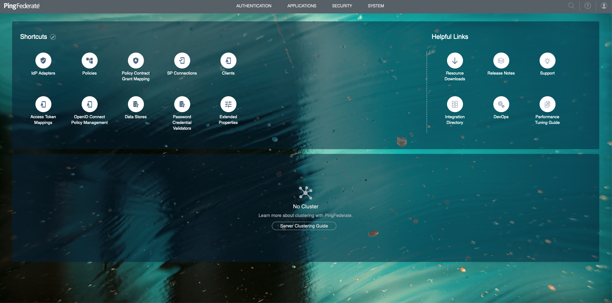
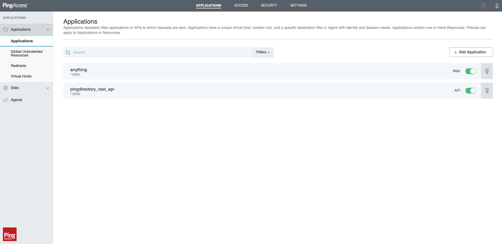
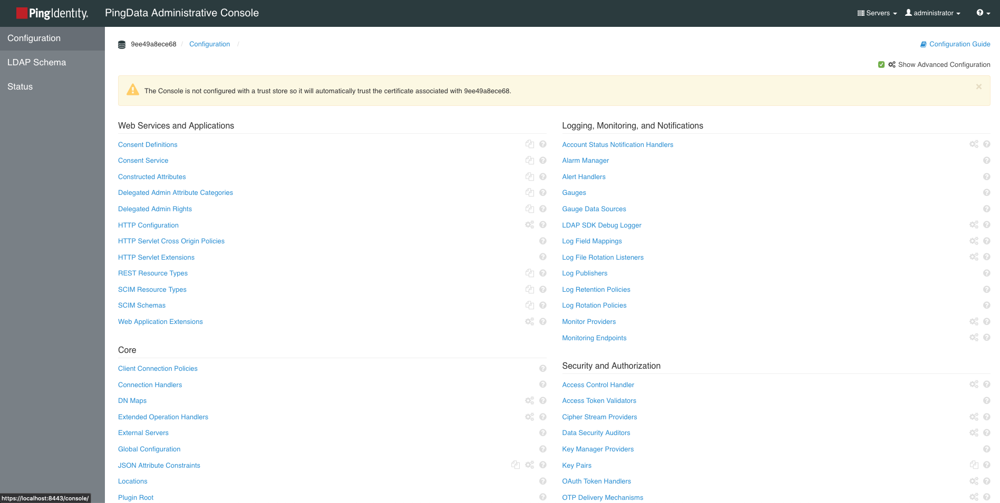
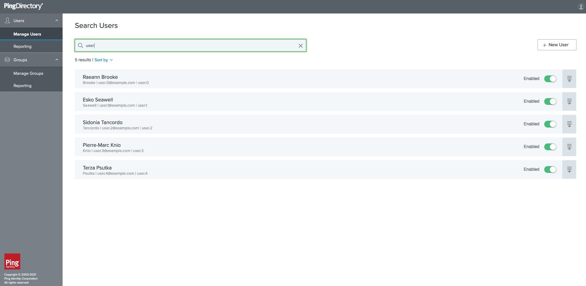

# Ping Identity BugBounty Setup
Docker compose configuration for quick deployment and testing of the Ping stack.

## Prerequisites
* [Docker](https://docs.docker.com/install/)
* [Docker Compose](https://docs.docker.com/compose/install/) (included with Docker Desktop on Mac and Windows)
* DevOps credentials to obtain licenses

## Setup
1. Rename `env.example` to `.env` and replace `<USER_EMAIL>` `<USER_KEY>` with your credentials
2. From a directory where the `docker-compose.yaml` file is located run `docker-compose up -d`
3. Monitor containers status with `docker-compose ps`
4. Verify all containers are running:
```
    Name                     Command               State                                             Ports
--------------------------------------------------------------------------------------------------------------------------------------------------------
pingaccess-bb        ./bootstrap.sh wait-for pi ...   Up      0.0.0.0:2443->1443/tcp, 0.0.0.0:3000->3000/tcp, 0.0.0.0:9000->9000/tcp
pingdataconsole-bb   ./bootstrap.sh start-server      Up      0.0.0.0:8443->8443/tcp
pingdelegator-bb     ./bootstrap.sh start-server      Up      0.0.0.0:6443->6443/tcp
pingdirectory-bb     ./bootstrap.sh start-server      Up      0.0.0.0:1389->1389/tcp, 0.0.0.0:1443->1443/tcp, 0.0.0.0:1636->1636/tcp, 1689/tcp, 5005/tcp
pingfederate-bb      ./bootstrap.sh wait-for pi ...   Up      0.0.0.0:9031->9031/tcp, 0.0.0.0:9999->9999/tcp
```
5. Log in to the management consoles for the products:

   * Ping Data Console for PingDirectory
     - Console URL: `https://localhost:8443/console`
     - Server: pingdirectory:1636
     - User: Administrator
     - Password: 2FederateM0re

   * PingFederate
     - Console URL: `https://localhost:9999/pingfederate/app`
     - User: Administrator
     - Password: 2FederateM0re

   * PingAccess
     - Console URL: `https://localhost:9000`
     - User: Administrator
     - Password: 2FederateM0re
   * Sample App through PingAccess
     - httpbin.org: `https://localhost:3000`

   * PingDelegator
     - URL: `https://localhost:6443`
     - User: administrator
     - Password: 2FederateM0re
     - PingFederate OIDC

   * Apache Directory Studio for PingDirectory
     - LDAP Port: 1636
     - LDAP BaseDN: dc=example,dc=com
     - Root Username: cn=administrator
     - Root Password: 2FederateM0re
     - HTTPS Port: 1443
     - HTTPS extensions endpoints
     ```log
      Available or Degraded State : https://localhost:1443/available-or-degraded-state
      Available State             : https://localhost:1443/available-state
      Configuration               : https://localhost:1443/config/*
      Consent                     : https://localhost:1443/consent/v1/*
      Delegated Admin             : https://localhost:1443/dadmin/v2/*
      Directory REST API          : https://localhost:1443/directory/v1/*
      Instance Root File          : https://localhost:1443/instance-root/*
      SCIM2                       : https://localhost:1443/scim/v2/*
      ```

6. Stop all containers with `docker-compose down` when done testing

## Pictures
### PingFederate:


### PingAccess:


### PingDirectory:


### DelegatedAdmin:


## Troubleshooting
1. Check full logs with `docker-compose logs -f ` or for a single product with `docker compose logs -f pingaccess|pingdirectory|pingfederate`
2. Consult the troubleshooting [Guide](https://devops.pingidentity.com/reference/troubleshooting/)
3. Delete volumes `docker volume rm $(docker volume ls -q | grep -rih 'ping.*\-out')`
4. Update images with `docker-compose pull` and restart with `docker-compose up --build --force-recreate -d`

### Errors
```
ERROR: for pingdelegator  Cannot start service pingdelegator: driver failed programming external connectivity on endpoint pingdelegator-bb (025e96555814d12caae4e79dc61c03182dba525f05d8c03deb678393e3fda3ac): Error starting userland proxy: listen tcp 0.0.0.0:6443: bind: address already in use
ERROR: Encountered errors while bringing up the project.
```
The Delegator application is running on the port 6443. Unfortunately, there is no simple way to change the port through environment variables. Disabling other services that use the same port solves the issue. **Kubernetes API** service is running on 6443.

```
Cross-Origin Request Blocked: The Same Origin Policy disallows reading the remote resource at https://localhost:1443/dadmin/v2/resourceTypes. (Reason: CORS request did not succeed)
```
CORS error occurs due to the browser blocking self-signed certificates. You need to visit affected resources and approve certificates.

## Hints
### Container's anatomy
Containers' internal structure is described in the [Guide](https://devops.pingidentity.com/reference/config/#imagecontainer-anatomy)

### SH into a container
You can shell into containers to inspect the file structure, view log files, make configuration changes with `docker exec -it pingdirectory-bb /bin/sh`. Use the `container_name` attribute value from the compose file as a target.
